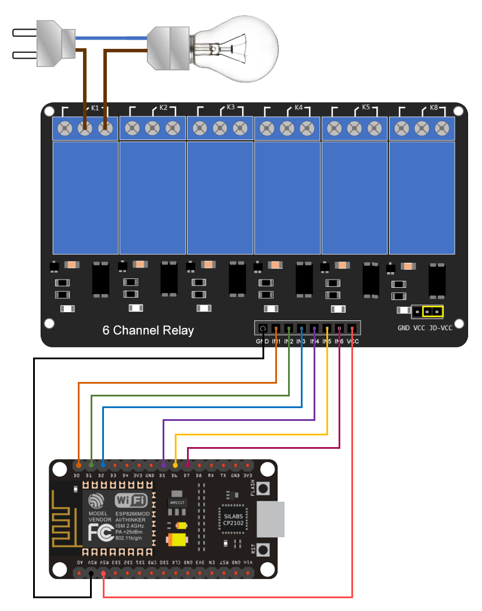

# ESP8266 (NodeMCU) Socket Controller

## Overview

ESP8266 only has a maximum of 6 ports that can be used seamlessly.
Available port for ESP8266:
- `GPIO16` (D0)
- `GPIO5` (D1)
- `GPIO4` (D2)
- `GPIO14` (D5)
- `GPIO12` (D6)
- `GPIO13` (D7)

## Scheme

### Buy Boards:
- [Buy NodeMCU ESP8266](https://www.google.com/search?q=buy+nodemcu+esp8266+lolin+v3)
- [Buy Relay Board 6 Channels](https://www.google.com/search?q=buy+relay+module+5v+6+channel)

### Scheme:

### Pinouts:
- `GPIO16` (D0) —> `IN1`
- `GPIO5` (D1) —> `IN2`
- `GPIO4` (D2) —> `IN3`
- `GPIO14` (D5) —> `IN4`
- `GPIO12` (D6) —> `IN5`
- `GPIO13` (D7) —> `IN6`
- `GND` —> `GND`
- `VBUS/VV` (5V) —> `VCC`

### Notes:
- Only *NodeMCU Lolin v3* version has a 5v output voltage, make sure you choose that version when buying.
- Relay Module has *optocoupler*, you can isolate the voltage to protect the microcontroller from electrical spikes.
Provide external power supply (5v) then connect to *GND* and *JD-VCC* on Relay Module board.
- Lolin NodeMCU V3 ESP8266 use CH340 chip to communicate with your computer over USB, download CH340 driver on link below if you can't connect to device.

## Programming

1. Install classic Arduino IDE, download from here https://www.arduino.cc/en/software/OldSoftwareReleases
2. Start Arduino and open the **Preferences** window.
3. Enter `https://arduino.esp8266.com/stable/package_esp8266com_index.json` into the **File > Preferences > Additional Boards Manager URLs** field of the Arduino IDE. You can add multiple URLs, separating them with commas.
4. Open **Boards Manager** from **Tools > Board** menu and install _esp8266_ platform (and don't forget to select your ESP8266 board from _Tools > Board_ menu after installation).
5. Copy all [code.ino](code.ino) content and paste into your IDE.
6. Upload or flash the code.

## Drivers

- CP210x Driver (https://www.silabs.com/developers/usb-to-uart-bridge-vcp-drivers)
- CH340G Driver (https://sparks.gogo.co.nz/ch340.html)

## References

- Arduino (https://www.arduino.cc/en/software)
- ESP8266 (https://github.com/esp8266/Arduino)
- How To Program An ESP8266 With the Arduino IDE - YouTube (https://www.youtube.com/watch?v=AFUAMVFzpWw)
