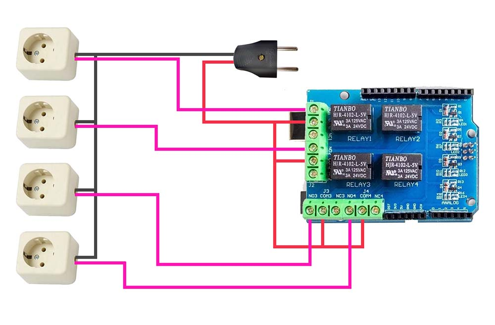

# Arduino UNO (Relay Shield) Socket Controller

## Overview

Making a socket controller with Arduino UNO and relay shield is an easy way. You can get the boards at your local electronic store. But the number of sockets is usually limited to only 4 channels.

## Schema

### Buy Boards:
- [Buy Arduino UNO](https://www.google.com/search?q=Buy+Arduino+UNO)
- [Buy Relay Shield for UNO](https://www.google.com/search?q=Buy+Relay+Shield+for+UNO)

### Scheme:

## Programming

1. Install Arduino IDE, download from here https://www.arduino.cc/en/software
2. Start Arduino and select your board COM port.
5. Copy all [code.ino](code.ino) content and paste into your IDE.
6. Upload or flash the code.

## Drivers

- CP210x Driver (https://www.silabs.com/developers/usb-to-uart-bridge-vcp-drivers)
- CH340G Driver (https://sparks.gogo.co.nz/ch340.html)
- FTDI Driver (https://support.arduino.cc/hc/en-us/articles/4411305694610-Install-or-update-FTDI-drivers)

## References

- Arduino (https://www.arduino.cc/en/software)
